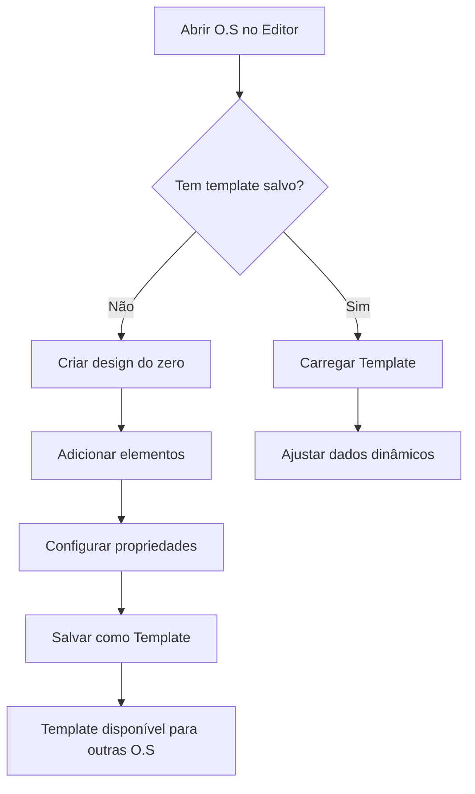

# Funcionalidade de Templates - Documentação

## 📋 Visão Geral

A funcionalidade de Templates permite salvar e reutilizar designs de etiquetas em diferentes Ordens de Serviço que possuam as mesmas dimensões de etiqueta.

## ✨ Funcionalidades Implementadas

### 1. **Salvar Template**

**Como usar:**
1. No editor, clique em **Arquivo** → **Salvar Template**
2. Uma modal será aberta solicitando o nome do template (opcional)
3. Se você **não digitar um nome**, o template será salvo automaticamente com o formato:
   - `Template [largura]×[altura]mm`
   - Exemplo: `Template 50×30mm`
4. Se você **digitar um nome**, esse nome será usado
5. Clique em **Salvar Template**

**O que é salvo:**
- ✅ Todos os elementos da etiqueta (textos, imagens, QR codes, códigos de barras, formas)
- ✅ Dimensões da etiqueta (largura × altura)
- ✅ Tamanho do papel
- ✅ Layout (colunas × linhas)
- ❌ **NÃO salva** os dados dinâmicos (CSV ou sequências)

### 2. **Carregar Template**

**Como usar:**
1. No editor, clique em **Arquivo** → **Carregar Template**
2. Uma modal será aberta mostrando **apenas templates compatíveis**
   - Templates compatíveis = mesmas dimensões da etiqueta atual
   - Exemplo: Se a O.S atual tem etiqueta 50×30mm, só mostrará templates com 50×30mm
3. Clique no template desejado para carregá-lo
4. Os elementos do template serão aplicados à etiqueta atual

**Informações exibidas:**
- Nome do template
- Data e hora de criação
- Número de elementos
- Dimensões da etiqueta
- Tamanho do papel
- Layout (colunas × linhas)

### 3. **Excluir Template**

**Como usar:**
1. Na modal de **Carregar Template**, passe o mouse sobre um template
2. Clique no ícone de **lixeira** (🗑️) que aparece
3. Confirme a exclusão
4. O template será removido permanentemente

## 🎯 Casos de Uso

### Caso 1: Reutilizar Design em Múltiplas O.S
```
1. Crie uma O.S com etiqueta 50×30mm
2. Desenhe a etiqueta no editor
3. Salve como template "Etiqueta Patrimônio"
4. Crie outra O.S com etiqueta 50×30mm
5. Carregue o template "Etiqueta Patrimônio"
6. Apenas ajuste os dados dinâmicos (CSV ou sequência)
```

### Caso 2: Biblioteca de Templates por Tamanho
```
Templates salvos:
- Template 50×30mm (Patrimônio)
- Template 50×30mm (Produto)
- Template 100×50mm (Caixa)
- Template 60×40mm (Bobina)

Ao abrir uma O.S com etiqueta 50×30mm:
→ Verá apenas os 2 templates de 50×30mm
```

## 🔒 Comportamento Importante

### Preservação da Configuração da Chapa
Quando você carrega um template:
- ✅ **Carrega:** Todos os elementos (textos, imagens, códigos, etc)
- ❌ **NÃO carrega:** Configurações da chapa (margens, espaçamentos)
- **Motivo:** A O.S já tem configurações bloqueadas da chapa original

### Compatibilidade de Dimensões
- Templates são **filtrados automaticamente** por dimensão
- Só aparecem templates com **exatamente** as mesmas dimensões
- Isso evita problemas de elementos fora da área da etiqueta

## 💾 Armazenamento

Os templates são salvos:
- **Onde:** LocalStorage do navegador
- **Chave:** `etiquetapro-storage`
- **Persistência:** Permanente (até limpar cache do navegador)
- **Compartilhamento:** Não compartilhado entre navegadores/computadores

## 🎨 Interface

### Modal de Salvar Template
```
┌─────────────────────────────────┐
│  Salvar Template            [×] │
├─────────────────────────────────┤
│                                 │
│  Nome do Template (opcional)    │
│  ┌───────────────────────────┐  │
│  │ Template 50×30mm          │  │
│  └───────────────────────────┘  │
│                                 │
│  ℹ️ Informações do Template:    │
│  • Dimensões: 50 × 30 mm        │
│  • Papel: A4                    │
│  • Layout: 4 × 8                │
│                                 │
│         [Cancelar] [Salvar]     │
└─────────────────────────────────┘
```

### Modal de Carregar Template
```
┌─────────────────────────────────┐
│  Carregar Template          [×] │
├─────────────────────────────────┤
│  Templates compatíveis com      │
│  50 × 30 mm                     │
├─────────────────────────────────┤
│  ┌─────────────────────────┐   │
│  │ Etiqueta Patrimônio  [🗑️]│   │
│  │ 📅 05/01/2026 às 15:30   │   │
│  │ 🏷️ 5 elementos           │   │
│  │ 📄 50×30mm | A4 | 4×8    │   │
│  └─────────────────────────┘   │
│                                 │
│  ┌─────────────────────────┐   │
│  │ Template Produto     [🗑️]│   │
│  │ 📅 04/01/2026 às 10:15   │   │
│  │ 🏷️ 3 elementos           │   │
│  │ 📄 50×30mm | A4 | 4×8    │   │
│  └─────────────────────────┘   │
└─────────────────────────────────┘
```

## 🚀 Fluxo Completo de Uso



## ⚠️ Limitações

1. **Dimensões exatas:** Templates só aparecem se as dimensões forem **exatamente iguais**
2. **Dados não salvos:** Configurações de CSV e sequências não são salvas
3. **Local apenas:** Templates não são sincronizados entre dispositivos
4. **Sem versionamento:** Não há histórico de versões de templates

## 🔧 Arquivos Modificados/Criados

### Novos Arquivos:
- `src/components/editor/SaveTemplateModal.tsx` - Modal de salvar
- `src/components/editor/LoadTemplateModal.tsx` - Modal de carregar

### Arquivos Modificados:
- `src/pages/Editor.tsx` - Integração dos modais
- `src/store/labelStore.ts` - Ajuste na função loadTemplate

## 📝 Notas Técnicas

### Validação de Compatibilidade
```typescript
const compatibleTemplates = templates.filter(
  (template) =>
    template.sheetConfig.labelWidth === sheetConfig.labelWidth &&
    template.sheetConfig.labelHeight === sheetConfig.labelHeight
);
```

### Deep Copy de Elementos
```typescript
elements: JSON.parse(JSON.stringify(template.elements))
```
Isso garante que modificações no template carregado não afetem o template original.

### Nome Automático
```typescript
const finalName = templateName.trim() || 
  `Template ${sheetConfig.labelWidth}×${sheetConfig.labelHeight}mm`;
```

---

**Desenvolvido para:** Asset Label Pro (FinalPrint)  
**Data:** 05/01/2026  
**Versão:** 1.0
