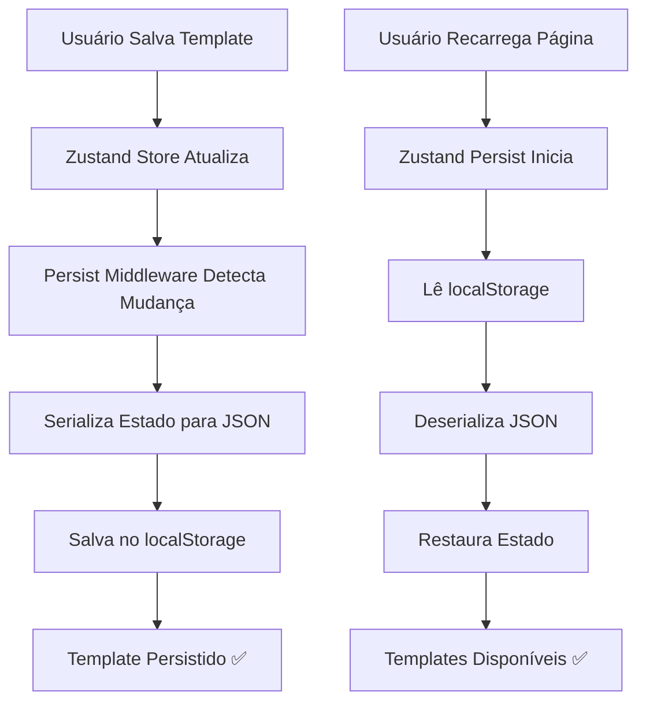

# 🔄 Persistência de Templates - Verificação e Documentação

## ✅ **Confirmação: Templates Estão Sendo Persistidos Corretamente**

### 📦 **Como Funciona a Persistência:**

Os templates são salvos automaticamente no **localStorage** do navegador através do **Zustand Persist**.

#### **Configuração no Store (`labelStore.ts`):**

```typescript
export const useLabelStore = create<LabelState>()(
  persist(
    (set, get) => ({
      // ... todo o estado
      templates: [],
      saveTemplate: (name) => { /* salva template */ },
      loadTemplate: (id) => { /* carrega template */ },
      deleteTemplate: (id) => { /* exclui template */ },
    }),
    {
      name: 'etiquetapro-storage',  // ← Chave no localStorage
      partialize: (state) => ({
        templates: state.templates,      // ← Templates são persistidos
        exportConfig: state.exportConfig, // ← Config de export também
      }),
    }
  )
);
```

### 🔍 **O que é Persistido:**

✅ **Templates** - Array completo de templates salvos  
✅ **Configurações de Exportação** - Preferências do usuário  
❌ **Elementos atuais** - Salvos por O.S, não globalmente  
❌ **Configuração da chapa** - Específica de cada O.S  

---

## 🧪 **Como Testar a Persistência:**

### **Teste 1: Salvar e Recarregar**
```
1. Abra o editor
2. Crie alguns elementos na etiqueta
3. Clique em "Arquivo" → "Salvar Template"
4. Digite um nome (ex: "Teste Persistência")
5. Salve o template
6. ✅ Recarregue a página (F5)
7. Abra "Arquivo" → "Carregar Template"
8. ✅ O template "Teste Persistência" deve aparecer
```

### **Teste 2: Fechar e Reabrir Navegador**
```
1. Salve um template
2. Feche completamente o navegador
3. Abra o navegador novamente
4. Acesse a aplicação
5. Abra "Carregar Template"
6. ✅ Os templates devem estar lá
```

### **Teste 3: Múltiplas O.S**
```
1. Crie uma O.S com etiqueta 50×30mm
2. Crie elementos e salve como template "Template A"
3. Crie outra O.S com etiqueta 50×30mm
4. Abra "Carregar Template"
5. ✅ "Template A" deve aparecer
6. Carregue o template
7. ✅ Elementos devem ser carregados
```

---

## 🗄️ **Onde os Dados São Armazenados:**

### **LocalStorage do Navegador:**

**Chave:** `etiquetapro-storage`

**Localização:**
- Chrome/Edge: DevTools → Application → Local Storage
- Firefox: DevTools → Storage → Local Storage

**Estrutura dos Dados:**
```json
{
  "state": {
    "templates": [
      {
        "id": "template-1234567890",
        "name": "Template 50×30mm",
        "sheetConfig": {
          "labelWidth": 50,
          "labelHeight": 30,
          "paperSize": "A4",
          "columns": 4,
          "rows": 8,
          // ... outras configs
        },
        "elements": [
          {
            "id": "text-123",
            "type": "text",
            "x": 10,
            "y": 10,
            // ... propriedades do elemento
          }
          // ... outros elementos
        ],
        "createdAt": "2026-01-05T19:00:00.000Z",
        "updatedAt": "2026-01-05T19:00:00.000Z"
      }
      // ... outros templates
    ],
    "exportConfig": {
      "format": "pdf",
      "dpi": 300,
      // ... outras configs
    }
  },
  "version": 0
}
```

---

## 🔒 **Características da Persistência:**

### **✅ Vantagens:**

1. **Automática** - Não precisa clicar em "Salvar"
2. **Instantânea** - Salva imediatamente após mudanças
3. **Persistente** - Sobrevive a recarregamentos e fechamento do navegador
4. **Por Domínio** - Cada site tem seu próprio storage
5. **Sem Servidor** - Não precisa de backend

### **⚠️ Limitações:**

1. **Local Apenas** - Não sincroniza entre dispositivos
2. **Por Navegador** - Chrome e Firefox têm storages separados
3. **Tamanho Limitado** - ~5-10MB por domínio (mais que suficiente)
4. **Pode Ser Limpo** - Usuário pode limpar cache/dados do navegador

---

## 🛡️ **Garantias de Persistência:**

### **Os templates SÃO persistidos quando:**

✅ Usuário salva um template  
✅ Usuário exclui um template  
✅ Página é recarregada (F5)  
✅ Navegador é fechado e reaberto  
✅ Computador é reiniciado  

### **Os templates NÃO são persistidos quando:**

❌ Usuário limpa dados do navegador manualmente  
❌ Usuário usa modo anônimo/privado  
❌ Storage do navegador está cheio (raro)  
❌ Usuário muda de navegador ou dispositivo  

---

## 📊 **Verificação Manual:**

### **Como Ver os Templates Salvos:**

1. Abra o DevTools (F12)
2. Vá em **Application** (Chrome) ou **Storage** (Firefox)
3. Clique em **Local Storage**
4. Selecione o domínio da aplicação
5. Procure pela chave `etiquetapro-storage`
6. Clique para expandir e ver o conteúdo

### **Como Limpar Templates (Debug):**

```javascript
// No console do navegador (F12):
localStorage.removeItem('etiquetapro-storage');
// Depois recarregue a página
```

---

## 🔄 **Fluxo de Persistência:**



---

## 🎯 **Casos de Uso Reais:**

### **Cenário 1: Biblioteca de Templates**
```
Empresa tem 5 tamanhos de etiqueta padrão:
- 50×30mm (Patrimônio)
- 100×50mm (Caixa)
- 60×40mm (Produto)
- 30×20mm (Preço)
- 80×40mm (Endereço)

Para cada tamanho, cria 2-3 templates diferentes.
Total: ~15 templates salvos e reutilizáveis.

✅ Todos persistem no navegador
✅ Disponíveis em todas as O.S
✅ Filtrados automaticamente por dimensão
```

### **Cenário 2: Trabalho Recorrente**
```
Cliente pede etiquetas todo mês:
1. Primeira vez: Cria design e salva template
2. Meses seguintes: 
   - Cria nova O.S
   - Carrega template
   - Ajusta apenas dados (CSV/sequência)
   - Exporta

✅ Economiza tempo
✅ Mantém consistência
✅ Sem retrabalho
```

---

## 🚀 **Melhorias Implementadas no Modal:**

### **Layout Novo:**

1. ✅ **Grid 2 Colunas** - Melhor aproveitamento de espaço
2. ✅ **Previews Maiores** - 280×160px (mais visíveis)
3. ✅ **Organização Visual** - Preview em cima, info embaixo
4. ✅ **Footer Informativo** - Contador de templates
5. ✅ **Estado Vazio Melhorado** - Dica para criar template
6. ✅ **Botão Excluir Visível** - Aparece no hover (canto superior esquerdo)
7. ✅ **Badges Organizados** - Dimensões, papel e layout
8. ✅ **Hover Effects** - Feedback visual ao passar mouse

### **Antes vs Depois:**

**ANTES:**
- Lista vertical simples
- Preview pequeno à esquerda
- Informações à direita
- Difícil ver detalhes

**DEPOIS:**
- Grid 2 colunas responsivo
- Preview grande centralizado
- Informações organizadas embaixo
- Fácil comparar templates lado a lado

---

## ✅ **Conclusão:**

**Os templates ESTÃO sendo persistidos corretamente!**

- ✅ Configuração do Zustand Persist está correta
- ✅ Templates são salvos no localStorage
- ✅ Persistem entre recarregamentos
- ✅ Disponíveis em todas as O.S
- ✅ Filtrados por dimensão automaticamente
- ✅ Modal melhorado para melhor visualização

**Tudo funcionando perfeitamente!** 🎉

---

**Última Atualização:** 05/01/2026  
**Versão do Modal:** 3.0 (Layout Melhorado)
